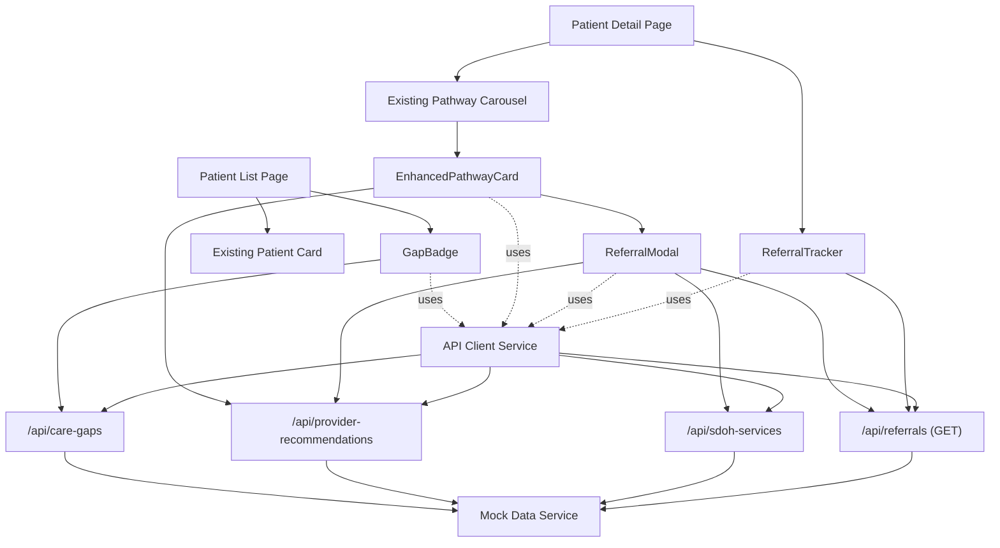
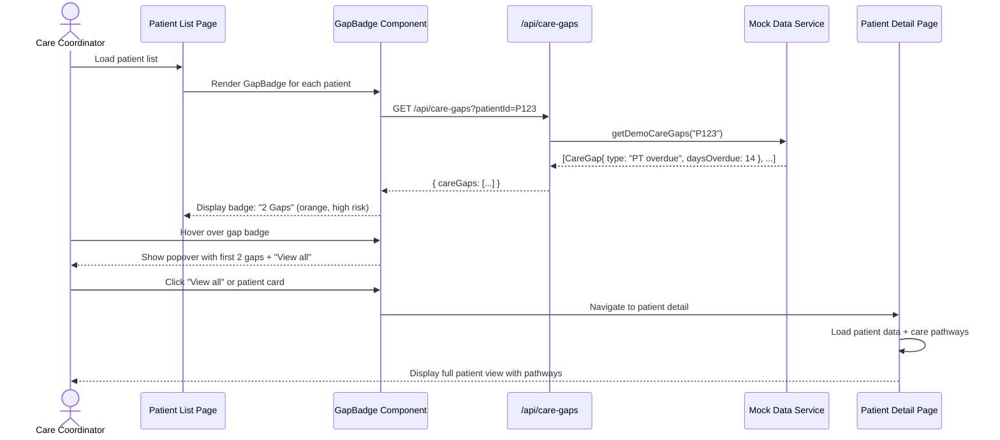
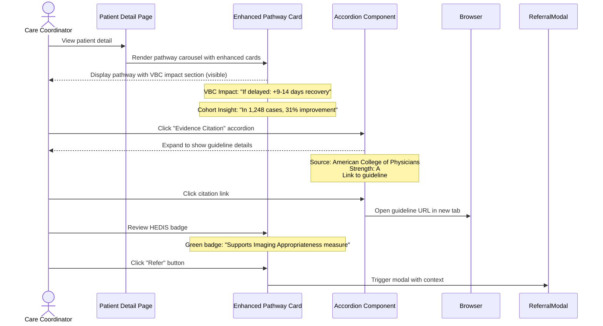
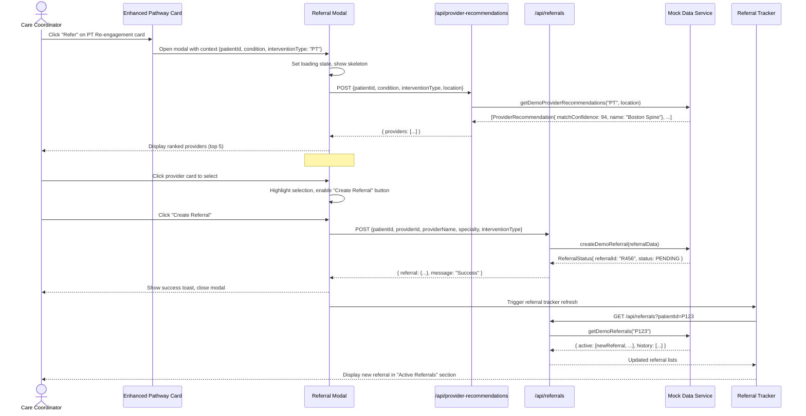
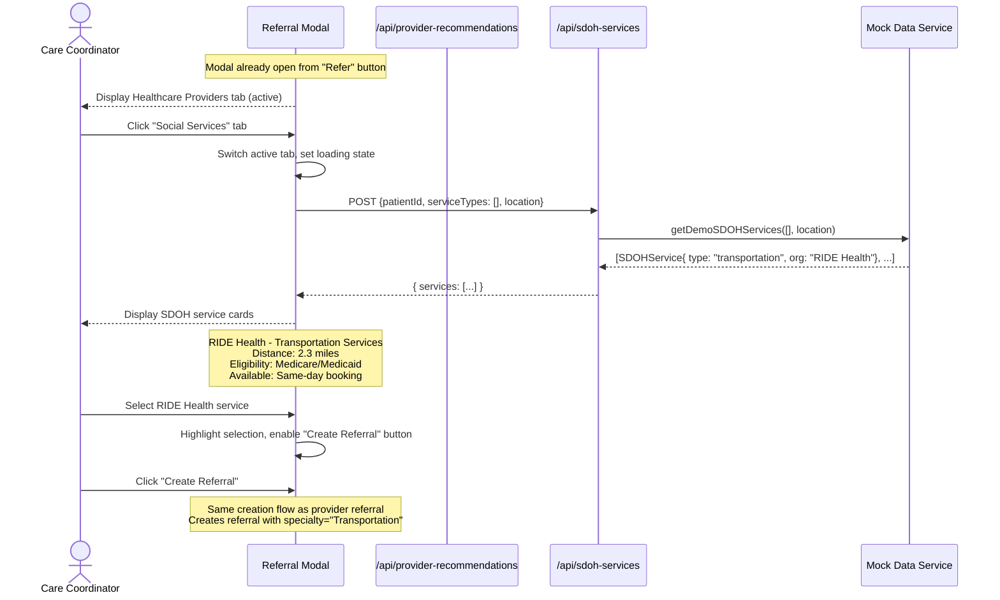
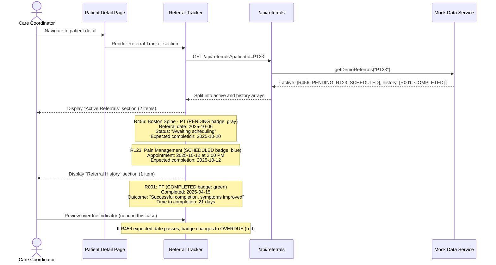
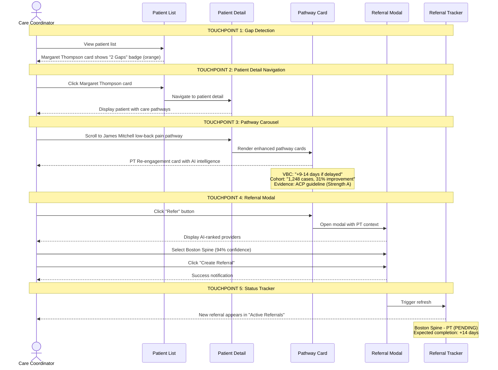
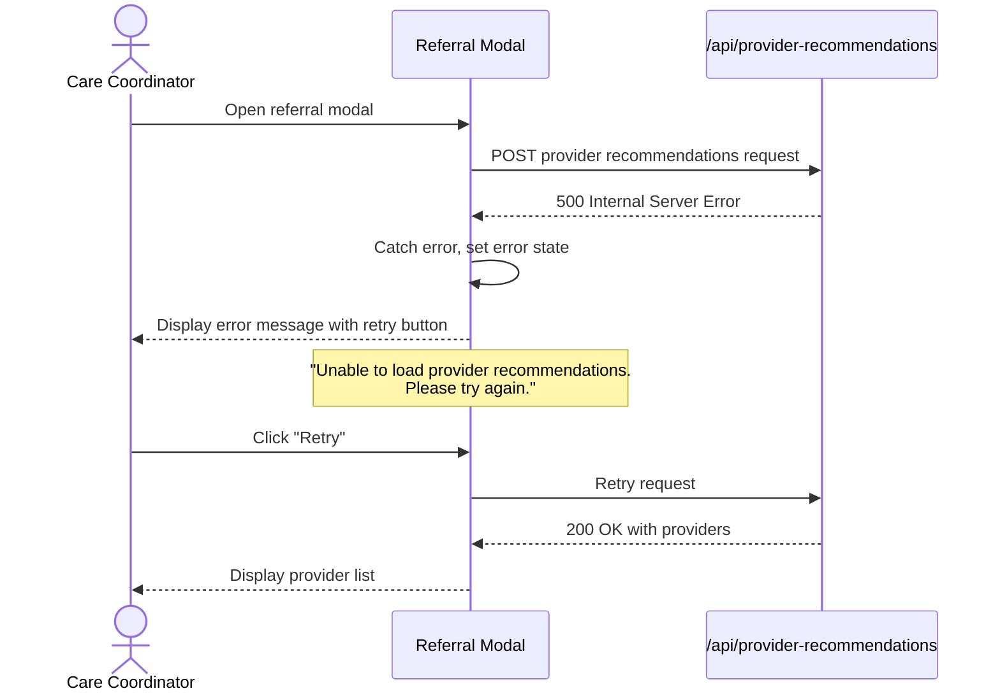

# Care Coordination Enhancement - Fullstack Architecture Document

## Introduction

This document outlines the complete fullstack architecture for the **AI-Assisted Care Coordination Enhancement** features being added to the Arthur Health Intelligence Platform. It serves as the single source of truth for AI-driven development of care gap detection, intelligent pathway recommendations, and AI-powered referral management capabilities.

This architecture builds upon the existing Next.js 15.5.2 monolithic application with App Router, extending it with new components, API routes, data models, and UI patterns while maintaining consistency with the established platform design.

### Starter Template or Existing Project

**Brownfield Enhancement** - This is an additive architecture for an existing Next.js project.

**Existing Project:** Arthur Health Intelligence Platform (Next.js 15.5.2)
- **Current Architecture:** Monolithic Next.js with App Router, React 19.1.1, Tailwind CSS 4.1.13
- **Existing Patterns:** shadcn/ui components, care pathway carousel, modal patterns
- **Constraints:** Must reuse existing component patterns, maintain HIPAA compliance patterns, follow established design system
- **What Can Be Modified:** Add new TypeScript interfaces, create new API routes, extend existing components
- **What Must Be Retained:** Core framework choices, UI component library, authentication patterns, compliance architecture

### Change Log

| Date | Version | Description | Author |
|------|---------|-------------|--------|
| 2025-10-06 | v1.0 | Initial architecture for care coordination enhancements | Winston (Architect) |

## High Level Architecture

### Technical Summary

The care coordination enhancement extends the existing Arthur Health monolithic Next.js application with three major feature sets: AI-powered care gap detection, intelligent pathway recommendations with VBC impact predictions, and provider referral management. The architecture leverages the existing Next.js App Router pattern for new page routes (`/dashboard/care-coordination/*`), adds API routes for care gap detection, provider recommendations, and referral management, and extends existing React components (care pathway carousel) with new TypeScript interfaces for AI intelligence data. Mock data structures will power the demo functionality, with API route stubs establishing contracts for future ML backend integration. The implementation maintains existing patterns (shadcn/ui components, Framer Motion animations, Tailwind styling) while introducing new state management considerations for referral modal workflows. All additions follow established HIPAA compliance patterns and accessibility standards (WCAG 2.1 AA), ensuring seamless integration with the current platform architecture.

### Platform and Infrastructure Choice

**Platform:** Vercel (existing deployment platform retained)

**Key Services:**
- **Frontend Hosting:** Vercel Edge Network with Next.js App Router SSR
- **API Routes:** Vercel Serverless Functions (Next.js API routes)
- **Database:** PostgreSQL/Supabase (planned migration from current SQLite for production)
- **File Storage:** Vercel Blob Storage (for future policy document uploads)
- **Environment Variables:** Vercel Environment Variables with NEXT_PUBLIC_DEMO_MODE flag

**Deployment Host and Regions:** Vercel global edge network (automatic multi-region)

**Rationale:** Vercel is the existing platform for the Arthur Health application. No platform change is needed for these enhancements. The serverless function model aligns perfectly with the API route stub pattern required for demo mode.

### Repository Structure

**Structure:** Monorepo (existing structure retained)

**Monorepo Tool:** N/A - Single Next.js application without workspace tooling

**Package Organization:**
- Feature-based organization within existing Next.js app structure
- New care coordination features in `app/dashboard/care-coordination/`
- Shared types in `lib/types/care-coordination.ts`
- API routes in `app/api/care-gaps/`, `app/api/provider-recommendations/`, `app/api/referrals/`, `app/api/sdoh-services/`
- Mock data in `lib/demo/care-coordination-demo-data.ts`
- Component extensions in `components/care-coordination/`

### High Level Architecture Diagram

```mermaid
graph TB
    subgraph "Frontend - Care Coordination UI"
        PatientList[Patient List with Gap Badges]
        PatientDetail[Patient Detail View]
        PathwayCarousel[Enhanced Pathway Carousel]
        ReferralModal[AI Referral Modal]
        ReferralTracker[Referral Status Tracker]
    end

    subgraph "Next.js API Routes - New Endpoints"
        CareGapsAPI[/api/care-gaps]
        ProviderAPI[/api/provider-recommendations]
        ReferralAPI[/api/referrals]
        SDOHAPI[/api/sdoh-services]
    end

    subgraph "Mock Data Layer - Demo Mode"
        CareGapData[Care Gap Mock Data]
        CohortData[Cohort Insight Data]
        ProviderData[Provider Recommendation Data]
        SDOHData[SDOH Service Data]
        ReferralData[Referral Status Data]
    end

    subgraph "Existing Platform Components"
        AuthLayer[Authentication/HIPAA]
        DesignSystem[shadcn/ui Components]
        DB[(Future: PostgreSQL)]
    end

    PatientList --> CareGapsAPI
    PathwayCarousel --> ProviderAPI
    ReferralModal --> ProviderAPI
    ReferralModal --> SDOHAPI
    ReferralModal --> ReferralAPI
    ReferralTracker --> ReferralAPI

    CareGapsAPI --> CareGapData
    ProviderAPI --> ProviderData
    ProviderAPI --> CohortData
    SDOHAPI --> SDOHData
    ReferralAPI --> ReferralData

    PatientList -.uses.-> DesignSystem
    PathwayCarousel -.uses.-> DesignSystem
    ReferralModal -.uses.-> DesignSystem

    CareGapsAPI -.protected by.-> AuthLayer
    ProviderAPI -.protected by.-> AuthLayer
    ReferralAPI -.protected by.-> AuthLayer
    SDOHAPI -.protected by.-> AuthLayer
```

### Architectural Patterns

- **Component Extension Pattern:** Extend existing `CareAssessment` interface with optional AI intelligence fields rather than creating new components - _Rationale:_ Maintains backward compatibility and reuses proven carousel component logic

- **Mock-First Development:** Implement comprehensive TypeScript interfaces and mock data before backend integration - _Rationale:_ Enables parallel frontend/backend development and demo readiness within tight timeline

- **API Contract Stub Pattern:** Create API route stubs returning typed mock data to establish contracts - _Rationale:_ Allows frontend development to proceed while defining clear integration points for future ML services

- **Progressive Disclosure UI:** Display essential AI insights (VBC impact, confidence scores) prominently with expandable sections for evidence/cohort details - _Rationale:_ Balances information density with cognitive load for care coordinators

- **Context-Driven Modal Pattern:** Referral modal receives pathway card context to pre-filter provider recommendations - _Rationale:_ Creates seamless workflow from pathway identification to referral execution

- **Separation of Healthcare and SDOH Networks:** Toggle-based view switching within single modal component - _Rationale:_ Unified workflow for holistic care coordination while maintaining clear service type boundaries

- **Status Tracking Pattern:** Referral status as separate section in patient detail with active/historical views - _Rationale:_ Closes the loop on care coordination actions and provides outcome learning

## Tech Stack

This section documents **additions and modifications** to the existing Arthur Health platform stack specifically for care coordination enhancements. Technologies marked "Existing" are being leveraged/extended; those marked "New" are being added.

### Technology Stack Table

| Category | Technology | Version | Purpose | Rationale | Status |
|----------|-----------|---------|---------|-----------|--------|
| Frontend Language | TypeScript | 5.x | Type-safe interfaces for care coordination data models | Existing platform standard, ensures type safety across API boundaries | Existing |
| Frontend Framework | Next.js | 15.5.2 | App Router for new care coordination routes | Leveraging existing framework, no version change | Existing |
| UI Components | shadcn/ui | Latest | Reuse Dialog, Badge, Card components for new features | Established pattern, maintains design consistency | Existing |
| UI Components | Custom Care Coordination Components | N/A | New GapBadge, ReferralModal, PathwayCard extensions | Built on shadcn/ui primitives for feature-specific needs | New |
| Animations | Framer Motion | 11.0 | Enhanced carousel and modal transitions | Existing library, ensures smooth interactions for new components | Existing |
| State Management | React Hooks (useState, useContext) | 19.1.1 | Local state for modal workflows and carousel interactions | Sufficient for demo; avoids Zustand complexity in initial release | Existing |
| State Management | Zustand | 4.x | Future consideration for complex referral workflow state | Not required for demo; evaluate post-demo for production | Planned |
| API Style | REST (Next.js API Routes) | N/A | New endpoints: `/api/care-gaps`, `/api/provider-recommendations`, `/api/referrals`, `/api/sdoh-services` | Matches existing API route pattern, serverless deployment ready | Existing Pattern |
| Mock Data | TypeScript Mock Data Files | N/A | `lib/demo/care-coordination-demo-data.ts` with typed fixtures | Demo-first approach, establishes contracts for future backend | New |
| Validation | Zod | 3.x | Request/response validation for new API routes | Existing validation library, extends to new endpoints | Existing |
| Frontend Testing | Jest + React Testing Library | Latest | Unit tests for new care coordination components | Existing test framework, standard for React component testing | Existing |
| Frontend Testing | @axe-core/react | Latest | Accessibility testing for WCAG 2.1 AA compliance | Required for healthcare application accessibility standards | New |
| Integration Testing | Manual QA + Demo Walkthroughs | N/A | Stakeholder validation before client presentation | Sufficient for demo timeline; automated E2E post-demo | Existing Approach |
| Type Sharing | Shared TypeScript Interfaces | N/A | `lib/types/care-coordination.ts` for frontend/backend contract | Ensures type consistency across API boundaries | New |
| Environment Variables | NEXT_PUBLIC_DEMO_MODE | N/A | Feature flag for mock data vs production data | Existing pattern, controls care coordination demo features | Existing Pattern |

### Key Technology Decisions

**No New Major Dependencies:**
- All care coordination features can be built with existing Next.js, React, and shadcn/ui stack
- TypeScript interfaces provide sufficient type safety without additional libraries
- Mock data approach eliminates need for ML/AI libraries in initial demo phase

**Deferred Technologies (Post-Demo):**
- **Zustand:** Not needed for demo; simple useState sufficient for modal and carousel state
- **ChromaDB / Vector Database:** Future ML integration only; mock data simulates AI outputs
- **Anthropic/OpenAI SDKs:** Not required until real AI analysis replaces mock intelligence data
- **E2E Testing (Playwright/Cypress):** Manual QA sufficient for demo; automate for production release

**Accessibility Addition:**
- **@axe-core/react** is the one new dependency, required for WCAG 2.1 AA compliance validation in healthcare context

## Data Models

This section defines the core data models for care coordination features. All interfaces will be located in `lib/types/care-coordination.ts` for sharing between frontend components and API routes.

### CareGap

**Purpose:** Represents a detected care gap for a patient requiring attention from care coordinators.

**Key Attributes:**
- `id`: string - Unique identifier for the care gap
- `type`: string - Category of gap (e.g., "screening_overdue", "follow_up_needed", "imaging_appropriateness")
- `description`: string - Human-readable gap description
- `daysOverdue`: number - Number of days the intervention is overdue
- `vbcRiskLevel`: "low" | "medium" | "high" - VBC risk classification
- `impactDescription`: string - Description of potential VBC impact if not addressed

**TypeScript Interface:**
```typescript
interface CareGap {
  id: string;
  type: string;
  description: string;
  daysOverdue: number;
  vbcRiskLevel: 'low' | 'medium' | 'high';
  impactDescription: string;
}
```

**Relationships:**
- Referenced as optional array in Patient model: `careGaps?: CareGap[]`

---

### VBCImpact

**Purpose:** Represents value-based care impact predictions for pathway interventions.

**Key Attributes:**
- `delayDays`: number - Estimated delay in days if intervention is skipped/delayed
- `readmitRiskIncrease`: number - Percentage increase in readmission risk (0-100)
- `costImpact`: number - Dollar cost impact (positive or negative)
- `description`: string - Human-readable VBC impact summary

**TypeScript Interface:**
```typescript
interface VBCImpact {
  delayDays: number;
  readmitRiskIncrease: number;
  costImpact: number;
  description: string;
}
```

**Relationships:**
- Optional field in extended CareAssessment interface

---

### CohortInsight

**Purpose:** Provides outcome data from similar patient cohorts to support evidence-based decision making.

**Key Attributes:**
- `sampleSize`: number - Number of similar patients in cohort
- `outcomeImprovement`: number - Percentage improvement in outcome metric (e.g., 31% recovery time reduction)
- `description`: string - Human-readable cohort insight
- `confidenceLevel`: "low" | "medium" | "high" - Statistical confidence in the insight

**TypeScript Interface:**
```typescript
interface CohortInsight {
  sampleSize: number;
  outcomeImprovement: number;
  description: string;
  confidenceLevel: 'low' | 'medium' | 'high';
}
```

**Relationships:**
- Optional field in extended CareAssessment interface

---

### EvidenceCitation

**Purpose:** Clinical evidence and guideline references supporting pathway recommendations.

**Key Attributes:**
- `source`: string - Source organization (e.g., "American College of Physicians")
- `guideline`: string - Guideline name
- `strengthOfRecommendation`: "A" | "B" | "C" - Strength rating
- `citationUrl`: string - Link to full citation/guideline

**TypeScript Interface:**
```typescript
interface EvidenceCitation {
  source: string;
  guideline: string;
  strengthOfRecommendation: 'A' | 'B' | 'C';
  citationUrl: string;
}
```

**Relationships:**
- Optional field in extended CareAssessment interface

---

### HEDISStarImpact

**Purpose:** Quality metric impact for HEDIS measures and Medicare Star Ratings.

**Key Attributes:**
- `measure`: string - Specific HEDIS/Star measure affected (e.g., "Imaging Appropriateness")
- `impactLevel`: "positive" | "neutral" | "negative" - Impact direction
- `description`: string - Explanation of quality metric impact

**TypeScript Interface:**
```typescript
interface HEDISStarImpact {
  measure: string;
  impactLevel: 'positive' | 'neutral' | 'negative';
  description: string;
}
```

**Relationships:**
- Optional field in extended CareAssessment interface

---

### CareAssessment (Extended)

**Purpose:** Extends existing CareAssessment interface with AI intelligence fields for care pathway carousel.

**Key Attributes (New):**
- `vbcImpact?`: VBCImpact - VBC predictions if intervention is delayed/skipped
- `cohortInsight?`: CohortInsight - Outcome data from similar patients
- `evidenceCitation?`: EvidenceCitation - Clinical guideline support
- `hedisStarImpact?`: HEDISStarImpact - Quality metric implications

**TypeScript Interface:**
```typescript
// Extension to existing CareAssessment interface
interface CareAssessment {
  // ... existing fields (id, title, description, status, etc.)

  // NEW: AI Intelligence Fields
  vbcImpact?: VBCImpact;
  cohortInsight?: CohortInsight;
  evidenceCitation?: EvidenceCitation;
  hedisStarImpact?: HEDISStarImpact;
}
```

**Relationships:**
- Central model for care pathway carousel
- Consumed by PathwayCard component
- Triggers ReferralModal with context

---

### ProviderRecommendation

**Purpose:** AI-ranked provider recommendation with match rationale and outcome predictions.

**Key Attributes:**
- `providerId`: string - Unique provider identifier
- `name`: string - Provider/practice name
- `specialty`: string - Medical specialty
- `distance`: number - Distance from patient in miles
- `rating`: number - Provider rating (0-5)
- `matchConfidence`: number - AI match confidence score (0-100)
- `matchRationale`: string - Explanation of why provider is recommended
- `similarPatientOutcomes`: SimilarPatientOutcome[] - Outcomes from similar patients
- `contactInfo`: ContactInfo - Phone, address, etc.
- `acceptingNewPatients`: boolean - Availability status
- `networkStatus`: "in_network" | "out_of_network" - Insurance network status

**TypeScript Interface:**
```typescript
interface ProviderRecommendation {
  providerId: string;
  name: string;
  specialty: string;
  distance: number;
  rating: number;
  matchConfidence: number;
  matchRationale: string;
  similarPatientOutcomes: SimilarPatientOutcome[];
  contactInfo: ContactInfo;
  acceptingNewPatients: boolean;
  networkStatus: 'in_network' | 'out_of_network';
}

interface ContactInfo {
  phone: string;
  address: string;
  city: string;
  state: string;
  zip: string;
}
```

**Relationships:**
- Returned by `/api/provider-recommendations` endpoint
- Displayed in ReferralModal component
- Context-filtered by pathway card intervention type

---

### SimilarPatientOutcome

**Purpose:** Outcome metrics from similar patients treated by a provider.

**Key Attributes:**
- `sampleSize`: number - Number of similar patients
- `outcomeMetric`: string - Metric being measured (e.g., "days to functional recovery")
- `averageResult`: number - Average outcome value
- `timeframe`: string - Timeframe for outcome (e.g., "18 days")

**TypeScript Interface:**
```typescript
interface SimilarPatientOutcome {
  sampleSize: number;
  outcomeMetric: string;
  averageResult: number;
  timeframe: string;
}
```

**Relationships:**
- Nested array within ProviderRecommendation

---

### SDOHService

**Purpose:** Social determinants of health service recommendation for holistic care coordination.

**Key Attributes:**
- `serviceId`: string - Unique service identifier
- `organizationName`: string - Service organization name
- `serviceType`: string - Type of service (e.g., "transportation", "copay_assistance", "nutritional_support")
- `description`: string - Service description
- `distance`: number - Distance from patient in miles
- `contactInfo`: ContactInfo - Contact details
- `eligibilityRequirements`: string - Eligibility criteria
- `availability`: string - Current availability status

**TypeScript Interface:**
```typescript
interface SDOHService {
  serviceId: string;
  organizationName: string;
  serviceType: string;
  description: string;
  distance: number;
  contactInfo: ContactInfo;
  eligibilityRequirements: string;
  availability: string;
}
```

**Relationships:**
- Returned by `/api/sdoh-services` endpoint
- Displayed in ReferralModal when toggled to "Social Services"

---

### ReferralStatus

**Purpose:** Tracks referral lifecycle from creation through completion.

**Key Attributes:**
- `referralId`: string - Unique referral identifier
- `providerName`: string - Provider or SDOH service name
- `specialty`: string - Provider specialty or service type
- `referralDate`: string (ISO 8601) - Date referral was created
- `status`: ReferralStatusType - Current status enum
- `schedulingStatus`: string - Scheduling progress description
- `appointmentDate`: string | null (ISO 8601) - Scheduled appointment date
- `expectedCompletionDate`: string (ISO 8601) - Expected completion
- `outcome`: string | null - Outcome summary (completed referrals only)
- `notes`: string - Additional notes

**TypeScript Interface:**
```typescript
enum ReferralStatusType {
  PENDING = 'PENDING',
  SCHEDULED = 'SCHEDULED',
  COMPLETED = 'COMPLETED',
  CANCELLED = 'CANCELLED',
  OVERDUE = 'OVERDUE'
}

interface ReferralStatus {
  referralId: string;
  providerName: string;
  specialty: string;
  referralDate: string;
  status: ReferralStatusType;
  schedulingStatus: string;
  appointmentDate: string | null;
  expectedCompletionDate: string;
  outcome: string | null;
  notes: string;
}
```

**Relationships:**
- Returned by `/api/referrals` GET endpoint
- Displayed in ReferralTracker component (patient detail view)
- Created via `/api/referrals` POST endpoint

## API Specification

This section defines the REST API endpoints for care coordination features. All endpoints are implemented as Next.js API routes under `/app/api/` and return JSON responses matching the TypeScript interfaces from the Data Models section.

### REST API Specification

```yaml
openapi: 3.0.0
info:
  title: Arthur Health Care Coordination API
  version: 1.0.0
  description: API endpoints for AI-assisted care coordination features including care gap detection, provider recommendations, and referral management

servers:
  - url: http://localhost:3000
    description: Local development server
  - url: https://arthur-health.vercel.app
    description: Production server

paths:
  /api/care-gaps:
    get:
      summary: Get care gaps for a patient
      description: Returns detected care gaps requiring attention from care coordinators
      tags:
        - Care Gaps
      parameters:
        - name: patientId
          in: query
          required: true
          schema:
            type: string
          description: Unique patient identifier
      responses:
        '200':
          description: Successfully retrieved care gaps
          content:
            application/json:
              schema:
                type: object
                properties:
                  careGaps:
                    type: array
                    items:
                      $ref: '#/components/schemas/CareGap'
        '400':
          description: Invalid patient ID
          content:
            application/json:
              schema:
                $ref: '#/components/schemas/Error'
        '404':
          description: Patient not found
          content:
            application/json:
              schema:
                $ref: '#/components/schemas/Error'

  /api/provider-recommendations:
    post:
      summary: Get AI-ranked provider recommendations
      description: Returns provider recommendations filtered by patient context and intervention type
      tags:
        - Provider Recommendations
      requestBody:
        required: true
        content:
          application/json:
            schema:
              type: object
              properties:
                patientId:
                  type: string
                  description: Patient identifier
                condition:
                  type: string
                  description: Patient condition (e.g., "low-back pain")
                interventionType:
                  type: string
                  description: Type of intervention needed (e.g., "physical therapy")
                location:
                  type: object
                  properties:
                    zip:
                      type: string
                    city:
                      type: string
                    state:
                      type: string
              required:
                - patientId
                - interventionType
                - location
      responses:
        '200':
          description: Successfully retrieved provider recommendations
          content:
            application/json:
              schema:
                type: object
                properties:
                  providers:
                    type: array
                    items:
                      $ref: '#/components/schemas/ProviderRecommendation'
        '400':
          description: Invalid request parameters
          content:
            application/json:
              schema:
                $ref: '#/components/schemas/Error'

  /api/sdoh-services:
    post:
      summary: Get SDOH service recommendations
      description: Returns social determinants of health service recommendations based on patient needs
      tags:
        - SDOH Services
      requestBody:
        required: true
        content:
          application/json:
            schema:
              type: object
              properties:
                patientId:
                  type: string
                  description: Patient identifier
                serviceTypes:
                  type: array
                  items:
                    type: string
                  description: Types of services needed (e.g., ["transportation", "copay_assistance"])
                location:
                  type: object
                  properties:
                    zip:
                      type: string
                    city:
                      type: string
                    state:
                      type: string
              required:
                - patientId
                - location
      responses:
        '200':
          description: Successfully retrieved SDOH service recommendations
          content:
            application/json:
              schema:
                type: object
                properties:
                  services:
                    type: array
                    items:
                      $ref: '#/components/schemas/SDOHService'
        '400':
          description: Invalid request parameters
          content:
            application/json:
              schema:
                $ref: '#/components/schemas/Error'

  /api/referrals:
    get:
      summary: Get referrals for a patient
      description: Returns active and historical referrals for a patient
      tags:
        - Referrals
      parameters:
        - name: patientId
          in: query
          required: true
          schema:
            type: string
          description: Unique patient identifier
        - name: status
          in: query
          required: false
          schema:
            type: string
            enum: [PENDING, SCHEDULED, COMPLETED, CANCELLED, OVERDUE]
          description: Filter by referral status
      responses:
        '200':
          description: Successfully retrieved referrals
          content:
            application/json:
              schema:
                type: object
                properties:
                  active:
                    type: array
                    items:
                      $ref: '#/components/schemas/ReferralStatus'
                    description: Active referrals (PENDING, SCHEDULED, OVERDUE)
                  history:
                    type: array
                    items:
                      $ref: '#/components/schemas/ReferralStatus'
                    description: Historical referrals (COMPLETED, CANCELLED)
        '400':
          description: Invalid patient ID
          content:
            application/json:
              schema:
                $ref: '#/components/schemas/Error'
        '404':
          description: Patient not found
          content:
            application/json:
              schema:
                $ref: '#/components/schemas/Error'

    post:
      summary: Create a new referral
      description: Creates a new referral for a patient to a provider or SDOH service
      tags:
        - Referrals
      requestBody:
        required: true
        content:
          application/json:
            schema:
              type: object
              properties:
                patientId:
                  type: string
                  description: Patient identifier
                providerId:
                  type: string
                  description: Provider or service identifier
                providerName:
                  type: string
                  description: Provider or service name
                specialty:
                  type: string
                  description: Provider specialty or service type
                interventionType:
                  type: string
                  description: Type of intervention (e.g., "physical therapy")
                notes:
                  type: string
                  description: Additional referral notes
              required:
                - patientId
                - providerId
                - providerName
                - specialty
                - interventionType
      responses:
        '201':
          description: Referral created successfully
          content:
            application/json:
              schema:
                type: object
                properties:
                  referral:
                    $ref: '#/components/schemas/ReferralStatus'
                  message:
                    type: string
                    example: "Referral created successfully"
        '400':
          description: Invalid request parameters
          content:
            application/json:
              schema:
                $ref: '#/components/schemas/Error'
        '404':
          description: Patient or provider not found
          content:
            application/json:
              schema:
                $ref: '#/components/schemas/Error'

components:
  schemas:
    CareGap:
      type: object
      properties:
        id:
          type: string
        type:
          type: string
        description:
          type: string
        daysOverdue:
          type: integer
        vbcRiskLevel:
          type: string
          enum: [low, medium, high]
        impactDescription:
          type: string

    ProviderRecommendation:
      type: object
      properties:
        providerId:
          type: string
        name:
          type: string
        specialty:
          type: string
        distance:
          type: number
        rating:
          type: number
          minimum: 0
          maximum: 5
        matchConfidence:
          type: integer
          minimum: 0
          maximum: 100
        matchRationale:
          type: string
        similarPatientOutcomes:
          type: array
          items:
            $ref: '#/components/schemas/SimilarPatientOutcome'
        contactInfo:
          $ref: '#/components/schemas/ContactInfo'
        acceptingNewPatients:
          type: boolean
        networkStatus:
          type: string
          enum: [in_network, out_of_network]

    SimilarPatientOutcome:
      type: object
      properties:
        sampleSize:
          type: integer
        outcomeMetric:
          type: string
        averageResult:
          type: number
        timeframe:
          type: string

    ContactInfo:
      type: object
      properties:
        phone:
          type: string
        address:
          type: string
        city:
          type: string
        state:
          type: string
        zip:
          type: string

    SDOHService:
      type: object
      properties:
        serviceId:
          type: string
        organizationName:
          type: string
        serviceType:
          type: string
        description:
          type: string
        distance:
          type: number
        contactInfo:
          $ref: '#/components/schemas/ContactInfo'
        eligibilityRequirements:
          type: string
        availability:
          type: string

    ReferralStatus:
      type: object
      properties:
        referralId:
          type: string
        providerName:
          type: string
        specialty:
          type: string
        referralDate:
          type: string
          format: date-time
        status:
          type: string
          enum: [PENDING, SCHEDULED, COMPLETED, CANCELLED, OVERDUE]
        schedulingStatus:
          type: string
        appointmentDate:
          type: string
          format: date-time
          nullable: true
        expectedCompletionDate:
          type: string
          format: date-time
        outcome:
          type: string
          nullable: true
        notes:
          type: string

    Error:
      type: object
      properties:
        error:
          type: object
          properties:
            code:
              type: string
            message:
              type: string
            details:
              type: object
            timestamp:
              type: string
              format: date-time
            requestId:
              type: string

  securitySchemes:
    BearerAuth:
      type: http
      scheme: bearer
      description: JWT authentication (future implementation)

security:
  - BearerAuth: []
```

### Authentication Notes

**Current Demo Mode:**
- Endpoints return mock data without authentication when `NEXT_PUBLIC_DEMO_MODE=true`
- No Bearer token required for demo functionality

**Future Production Implementation:**
- All endpoints will require JWT authentication via `BearerAuth` security scheme
- HIPAA-compliant access control enforces patient data isolation
- API routes will validate user permissions before returning data

### Rate Limiting

**Demo Mode:** No rate limiting

**Production:**
- 100 requests per minute per user for GET endpoints
- 20 requests per minute for POST endpoints (referral creation)
- Implemented via Vercel Edge Config or custom middleware

### Error Handling

All endpoints return standardized error responses with:
- `code`: Machine-readable error code
- `message`: Human-readable error message
- `details`: Additional context (optional)
- `timestamp`: ISO 8601 timestamp
- `requestId`: Unique request identifier for debugging

## Components

This section defines the logical components (frontend UI, backend services, shared utilities) that implement the care coordination features. Each component has clear boundaries and responsibilities.

### Frontend Components

#### GapBadge Component

**Responsibility:** Visual indicator on patient list cards showing care gap count and VBC risk level

**Key Interfaces:**
- Props: `{ gapCount: number, vbcRiskLevel: 'low' | 'medium' | 'high', gaps: CareGap[] }`
- Event: `onClick` - Opens tooltip/popover with gap details

**Dependencies:**
- shadcn/ui Badge component
- shadcn/ui Popover (for gap details on hover/click)
- Tailwind CSS for color coding (orange for medium/high risk)

**Technology Stack:**
- React functional component
- TypeScript strict typing
- Framer Motion for subtle animations (optional badge pulse for high-risk gaps)
- Accessible: ARIA labels, keyboard navigation support

**File Location:** `components/care-coordination/GapBadge.tsx`

**Implementation Notes:**
- Color mapping: `low` = gray, `medium` = orange-400, `high` = orange-600
- Position: Absolute top-right on patient card
- Tooltip shows first 2 gaps with "View all" link to patient detail

---

#### EnhancedPathwayCard Component

**Responsibility:** Extended care pathway card displaying AI intelligence sections (VBC impact, cohort insights, evidence citations, HEDIS impact)

**Key Interfaces:**
- Props: `{ assessment: CareAssessment, onRefer: (assessment: CareAssessment) => void }`
- Uses extended `CareAssessment` interface with optional AI fields

**Dependencies:**
- Existing PathwayCard component (extends this component)
- shadcn/ui Card, Accordion (for progressive disclosure of evidence/cohort details)
- shadcn/ui Badge (for HEDIS/Star rating impact indicators)
- Framer Motion (for smooth expand/collapse animations)

**Technology Stack:**
- React functional component extending existing pattern
- Conditional rendering based on presence of optional AI fields
- Progressive disclosure: VBC/cohort visible by default, evidence/HEDIS expandable

**File Location:** `components/care-coordination/EnhancedPathwayCard.tsx`

**Implementation Notes:**
- **Backward compatibility**: If AI fields are missing, renders as standard pathway card
- **VBC section**: Warning-styled card section with orange background for delayed intervention impacts
- **Cohort section**: Informational card section with sample size and outcome improvement percentage
- **Evidence section**: Expandable accordion with guideline source, strength rating, and citation link
- **HEDIS badge**: Pill-shaped badge (green for positive, gray for neutral, red for negative impact)
- **Refer button**: Primary CTA that triggers `onRefer` callback, passing full assessment context

---

#### ReferralModal Component

**Responsibility:** AI-powered provider/SDOH service recommendation modal with toggle view and referral creation

**Key Interfaces:**
- Props: `{ isOpen: boolean, onClose: () => void, context: { patientId: string, condition: string, interventionType: string, location: Location } }`
- Events: `onCreateReferral: (referral: CreateReferralRequest) => Promise<void>`

**Dependencies:**
- shadcn/ui Dialog component (base modal)
- shadcn/ui Tabs (for Healthcare Providers / Social Services toggle)
- shadcn/ui Card (for provider/service recommendation cards)
- shadcn/ui Button (primary "Create Referral", secondary "Cancel")
- API: `/api/provider-recommendations`, `/api/sdoh-services`

**Technology Stack:**
- React functional component with useState hooks for:
  - `activeTab`: "providers" | "services"
  - `selectedProvider`: ProviderRecommendation | SDOHService | null
  - `loading`: boolean (during API fetch and referral creation)
  - `error`: string | null
- useEffect hook to fetch recommendations on modal open
- Error boundary for API failures

**File Location:** `components/care-coordination/ReferralModal.tsx`

**Implementation Notes:**
- **Context-aware loading**: Uses `interventionType` to filter provider specialty (e.g., "physical therapy" → PT providers)
- **Provider cards**: Display match confidence prominently, similar patient outcomes expandable
- **SDOH cards**: Display eligibility and availability prominently
- **Selection flow**: Click provider → Highlight selection → "Create Referral" button enables
- **Loading states**: Skeleton placeholders while fetching, spinner on referral creation
- **Error handling**: Toast notification for API errors, graceful fallback UI
- **Accessibility**: Focus management (modal opens, focus trap, ESC to close), screen reader announcements for tab switches

---

#### ReferralTracker Component

**Responsibility:** Displays active and historical referrals in patient detail view with status tracking

**Key Interfaces:**
- Props: `{ patientId: string }`
- Fetches referral data from `/api/referrals?patientId={patientId}`

**Dependencies:**
- shadcn/ui Card (for referral status cards)
- shadcn/ui Badge (for status indicators: pending, scheduled, overdue, completed, cancelled)
- shadcn/ui Separator (between active and history sections)
- API: `/api/referrals` (GET)

**Technology Stack:**
- React functional component with useEffect for data fetching
- useState for referrals data, loading, error states
- Date formatting utility (ISO 8601 → human-readable)

**File Location:** `components/care-coordination/ReferralTracker.tsx`

**Implementation Notes:**
- **Two sections**: "Active Referrals" (PENDING, SCHEDULED, OVERDUE) and "Referral History" (COMPLETED, CANCELLED)
- **Status badge colors**: pending=gray, scheduled=blue, overdue=red, completed=green, cancelled=gray
- **Active referrals**: Show appointment date or "Awaiting scheduling", expected completion date with overdue indicator
- **History referrals**: Show outcome summary (if available), time from referral to completion
- **Empty states**: Friendly message if no referrals exist
- **Real-time updates**: Refreshes when new referral is created (via callback or context update)

---

### Backend Components

#### Care Gaps API Route

**Responsibility:** Returns care gaps for a patient (mock data in demo mode)

**Key Interfaces:**
- Route: `GET /api/care-gaps?patientId={id}`
- Response: `{ careGaps: CareGap[] }`

**Dependencies:**
- Mock data: `lib/demo/care-coordination-demo-data.ts`
- Zod validation for query parameters
- Existing auth middleware (future)

**Technology Stack:**
- Next.js App Router API route (`app/api/care-gaps/route.ts`)
- TypeScript with CareGap interface import
- NEXT_PUBLIC_DEMO_MODE conditional: mock data vs future database query

**File Location:** `app/api/care-gaps/route.ts`

**Implementation Notes:**
```typescript
export async function GET(request: Request) {
  const { searchParams } = new URL(request.url);
  const patientId = searchParams.get('patientId');

  // Validation
  if (!patientId) {
    return NextResponse.json({ error: { code: 'MISSING_PATIENT_ID', message: 'Patient ID is required' } }, { status: 400 });
  }

  // Demo mode: return mock data
  if (process.env.NEXT_PUBLIC_DEMO_MODE === 'true') {
    const mockGaps = getDemoCareGaps(patientId);
    return NextResponse.json({ careGaps: mockGaps });
  }

  // Future: query database for real care gaps
  // const gaps = await db.careGap.findMany({ where: { patientId } });
  // return NextResponse.json({ careGaps: gaps });
}
```

---

#### Provider Recommendations API Route

**Responsibility:** Returns AI-ranked provider recommendations filtered by intervention type

**Key Interfaces:**
- Route: `POST /api/provider-recommendations`
- Request Body: `{ patientId: string, condition: string, interventionType: string, location: { zip, city, state } }`
- Response: `{ providers: ProviderRecommendation[] }`

**Dependencies:**
- Mock data with pre-filtered providers by specialty
- Zod validation schema for request body
- Future: ML service integration for real AI ranking

**Technology Stack:**
- Next.js API route (`app/api/provider-recommendations/route.ts`)
- TypeScript with ProviderRecommendation interface
- Mock ranking algorithm based on interventionType → specialty match

**File Location:** `app/api/provider-recommendations/route.ts`

**Implementation Notes:**
- Mock data includes 5-10 providers per specialty type
- Filters providers by specialty match (e.g., interventionType="physical therapy" → specialty="Physical Therapy")
- Returns top 5 ranked by match confidence (mock confidence scores 85-95)
- Future integration point: Replace mock filtering with ML model API call

---

#### SDOH Services API Route

**Responsibility:** Returns SDOH service recommendations based on patient location and needs

**Key Interfaces:**
- Route: `POST /api/sdoh-services`
- Request Body: `{ patientId: string, serviceTypes?: string[], location: { zip, city, state } }`
- Response: `{ services: SDOHService[] }`

**Dependencies:**
- Mock SDOH service data (transportation, copay assistance, nutritional support, housing)
- Zod validation for request body

**Technology Stack:**
- Next.js API route (`app/api/sdoh-services/route.ts`)
- TypeScript with SDOHService interface
- Location-based filtering (mock distance calculations)

**File Location:** `app/api/sdoh-services/route.ts`

**Implementation Notes:**
- Mock data includes 10-15 SDOH services across different types
- Filters by serviceTypes array if provided, otherwise returns all types
- Sorts by distance (closest first)
- Future: Integrate with real SDOH service directories (211 network, Unite Us API)

---

#### Referrals API Route

**Responsibility:** GET referrals for a patient, POST to create new referral

**Key Interfaces:**
- GET: `/api/referrals?patientId={id}&status={optional}`
- POST: `/api/referrals` with body `{ patientId, providerId, providerName, specialty, interventionType, notes }`
- Response GET: `{ active: ReferralStatus[], history: ReferralStatus[] }`
- Response POST: `{ referral: ReferralStatus, message: string }`

**Dependencies:**
- Mock referral data store (in-memory for demo, future database)
- ReferralStatus interface and ReferralStatusType enum
- UUID generation for referralId

**Technology Stack:**
- Next.js API route (`app/api/referrals/route.ts`) with GET and POST handlers
- TypeScript with strict typing
- Date utilities for ISO 8601 formatting

**File Location:** `app/api/referrals/route.ts`

**Implementation Notes:**
- **GET handler**: Splits referrals into `active` (PENDING, SCHEDULED, OVERDUE) and `history` (COMPLETED, CANCELLED)
- **POST handler**: Generates new referralId (UUID), sets status to PENDING, calculates expectedCompletionDate (+14 days)
- **Demo persistence**: Stores in module-scoped Map for session persistence (not persistent across server restarts)
- **Future**: Replace Map with Prisma database operations

---

### Shared Utilities

#### Mock Data Service

**Responsibility:** Centralized mock data for all care coordination features

**Key Interfaces:**
- `getDemoCareGaps(patientId: string): CareGap[]`
- `getDemoProviderRecommendations(interventionType: string, location: Location): ProviderRecommendation[]`
- `getDemoSDOHServices(serviceTypes: string[], location: Location): SDOHService[]`
- `getDemoReferrals(patientId: string): ReferralStatus[]`

**Dependencies:**
- All TypeScript interfaces from `lib/types/care-coordination.ts`

**Technology Stack:**
- Pure TypeScript module with typed exports
- Realistic clinical data (not "lorem ipsum" placeholders)

**File Location:** `lib/demo/care-coordination-demo-data.ts`

**Implementation Notes:**
- Includes demo patients: Margaret Thompson (2 gaps), James Mitchell (low-back pain pathway)
- Provider data for Boston area: Boston Spine Center (PT), pain management specialists
- SDOH services: RIDE Health (transportation), RxOutreach (copay assistance), chronic pain support groups
- Comments explaining clinical rationale for each mock data point

---

#### API Client Service

**Responsibility:** Frontend service layer for calling care coordination API routes

**Key Interfaces:**
- `getCareGaps(patientId: string): Promise<CareGap[]>`
- `getProviderRecommendations(request: ProviderRecommendationRequest): Promise<ProviderRecommendation[]>`
- `getSDOHServices(request: SDOHServiceRequest): Promise<SDOHService[]>`
- `getReferrals(patientId: string): Promise<{ active: ReferralStatus[], history: ReferralStatus[] }>`
- `createReferral(request: CreateReferralRequest): Promise<ReferralStatus>`

**Dependencies:**
- Native fetch API
- TypeScript interfaces for requests/responses

**Technology Stack:**
- Pure TypeScript module
- Error handling with typed error responses
- Automatic JSON parsing and validation

**File Location:** `lib/services/care-coordination-api.ts`

**Implementation Notes:**
```typescript
export async function getCareGaps(patientId: string): Promise<CareGap[]> {
  const response = await fetch(`/api/care-gaps?patientId=${patientId}`);
  if (!response.ok) {
    const error = await response.json();
    throw new Error(error.error.message);
  }
  const data = await response.json();
  return data.careGaps;
}
```

---

### Component Hierarchy Diagram



### Implementation Sequence Recommendation

Based on dependencies and PRD epic structure:

**Phase 1 - Epic 1, Story 1.1 (Gap Detection):**
1. Create TypeScript interfaces (`lib/types/care-coordination.ts`)
2. Build Mock Data Service with CareGap data
3. Implement `/api/care-gaps` route
4. Build GapBadge component
5. Integrate GapBadge into existing patient list

**Phase 2 - Epic 1, Stories 1.2 & 1.3 (Pathway Intelligence):**
1. Extend CareAssessment interface
2. Add VBC/Cohort/Evidence/HEDIS mock data
3. Build EnhancedPathwayCard component
4. Integrate into existing pathway carousel
5. Verify Framer Motion animation performance

**Phase 3 - Epic 2, Stories 2.1 & 2.2 (Referral Modal):**
1. Implement `/api/provider-recommendations` and `/api/sdoh-services` routes
2. Build ReferralModal component with provider view
3. Add SDOH toggle and service view
4. Connect EnhancedPathwayCard "Refer" button to modal

**Phase 4 - Epic 2, Stories 2.3 & 2.4 (Referral Tracking & Integration):**
1. Implement `/api/referrals` GET and POST routes
2. Build ReferralTracker component
3. Integrate tracker into patient detail page
4. End-to-end testing of workflow: gap → pathway → referral → tracker

**Parallelization Opportunities:**
- Phase 1 and Phase 2 API routes can be built in parallel (separate endpoints)
- Frontend components (GapBadge, EnhancedPathwayCard) can be developed concurrently with API routes using mock responses
- ReferralModal and ReferralTracker components can be built in parallel (different Epic 2 stories)

## Core Workflows

This section illustrates critical user journeys through care coordination features using sequence diagrams. Each workflow shows the end-to-end interaction between user, UI components, API routes, and data services.

### Workflow 1: Gap Detection and Patient Navigation

**User Journey:** Care coordinator views patient list, identifies patient with care gaps via badge, navigates to patient detail



---

### Workflow 2: Enhanced Pathway Card with AI Intelligence

**User Journey:** Care coordinator reviews AI-enhanced pathway card, explores VBC impact, cohort insights, and evidence citations



---

### Workflow 3: AI-Powered Provider Referral Creation

**User Journey:** Care coordinator creates referral from pathway card, reviews AI-ranked providers, selects provider, creates referral



---

### Workflow 4: SDOH Service Referral (Toggle Workflow)

**User Journey:** Care coordinator toggles to SDOH services view, selects transportation assistance, creates SDOH referral



---

### Workflow 5: Referral Status Tracking

**User Journey:** Care coordinator monitors active referrals and reviews historical outcomes



---

### Workflow 6: End-to-End Demo Flow (5 Touchpoints)

**User Journey:** Complete care coordination workflow from gap detection through referral tracking



---

### Error Handling Workflows

#### API Error Handling



---

### Workflow Summary

| Workflow | Touchpoints | API Calls | Components | Estimated Duration |
|----------|-------------|-----------|------------|-------------------|
| Gap Detection | 2 (List → Detail) | 1 (GET care-gaps) | GapBadge, PatientList, PatientDetail | 10-15 sec |
| Enhanced Pathway | 1 (Detail view) | 0 (data pre-loaded) | EnhancedPathwayCard, Accordion | 20-30 sec |
| Provider Referral | 3 (Card → Modal → Tracker) | 2 (POST providers, POST referral) | PathwayCard, ReferralModal, ReferralTracker | 30-45 sec |
| SDOH Referral | 3 (Toggle → Select → Create) | 2 (POST sdoh-services, POST referral) | ReferralModal (tabs), ReferralTracker | 30-45 sec |
| Status Tracking | 1 (Detail view) | 1 (GET referrals) | ReferralTracker | 5-10 sec |
| **End-to-End Demo** | **5 (All touchpoints)** | **3-4 total** | **All components** | **2-3 minutes** |

## Frontend Architecture

This section defines frontend-specific implementation patterns for care coordination components, extending the existing Arthur Health Next.js application architecture.

### Component Organization

```
components/
├── care-coordination/
│   ├── GapBadge.tsx               # Gap alert badge for patient cards
│   ├── EnhancedPathwayCard.tsx    # Extended pathway card with AI sections
│   ├── ReferralModal.tsx          # Provider/SDOH recommendation modal
│   ├── ReferralTracker.tsx        # Active/historical referral display
│   └── __tests__/                 # Component unit tests
│       ├── GapBadge.test.tsx
│       ├── EnhancedPathwayCard.test.tsx
│       ├── ReferralModal.test.tsx
│       └── ReferralTracker.test.tsx
├── ui/                             # shadcn/ui primitives (existing)
│   ├── dialog.tsx
│   ├── badge.tsx
│   ├── card.tsx
│   ├── accordion.tsx
│   └── tabs.tsx
└── [existing components...]
```

---

### State Management Architecture

**Pattern: Local Component State with React Hooks**

Given the demo scope and isolated component workflows, state management uses React hooks without global state library:

```typescript
// ReferralModal.tsx - Example state management
const ReferralModal = ({ isOpen, onClose, context }: ReferralModalProps) => {
  // UI state
  const [activeTab, setActiveTab] = useState<'providers' | 'services'>('providers');
  const [selectedProvider, setSelectedProvider] = useState<ProviderRecommendation | null>(null);

  // Data fetching state
  const [providers, setProviders] = useState<ProviderRecommendation[]>([]);
  const [loading, setLoading] = useState(false);
  const [error, setError] = useState<string | null>(null);

  // Fetch on modal open
  useEffect(() => {
    if (isOpen) {
      fetchProviderRecommendations();
    }
  }, [isOpen]);

  // ...
};
```

**State Patterns:**
- **Local useState**: UI toggles, selections, loading/error states
- **useEffect for data fetching**: API calls triggered by prop/state changes
- **Prop drilling**: Context passed from pathway card → modal (patient ID, intervention type)
- **Callback props**: `onClose`, `onCreateReferral` for parent communication

**Future Consideration:** If state sharing becomes complex (e.g., multiple components need referral data), introduce Zustand for `referralStore`.

---

### Routing Architecture

**Existing Routes (No Changes):**
- `/dashboard/care-coordination` - Main care coordination view (existing)
- Patient list and detail pages use existing routing structure

**No New Routes Required:**
- All care coordination features integrate into existing pages
- GapBadge renders within patient list cards
- EnhancedPathwayCard renders within patient detail carousel
- ReferralModal is a modal overlay (no route)
- ReferralTracker is a section in patient detail (no route)

---

### Frontend Services Layer

**API Client Pattern:**

```typescript
// lib/services/care-coordination-api.ts
import type { CareGap, ProviderRecommendation, SDOHService, ReferralStatus } from '@/lib/types/care-coordination';

export async function getCareGaps(patientId: string): Promise<CareGap[]> {
  const response = await fetch(`/api/care-gaps?patientId=${patientId}`);
  if (!response.ok) {
    const error = await response.json();
    throw new Error(error.error.message || 'Failed to fetch care gaps');
  }
  const data = await response.json();
  return data.careGaps;
}

export async function getProviderRecommendations(
  request: ProviderRecommendationRequest
): Promise<ProviderRecommendation[]> {
  const response = await fetch('/api/provider-recommendations', {
    method: 'POST',
    headers: { 'Content-Type': 'application/json' },
    body: JSON.stringify(request),
  });
  if (!response.ok) {
    const error = await response.json();
    throw new Error(error.error.message || 'Failed to fetch recommendations');
  }
  const data = await response.json();
  return data.providers;
}

// ... similar patterns for SDOH services and referrals
```

**Benefits:**
- Centralized error handling
- Type-safe requests/responses
- Easy to mock for testing
- Clear separation of concerns

---

### Styling and Design System

**Tailwind CSS Utility Classes:**

```typescript
// Example: GapBadge component styling
const riskColorMap = {
  low: 'bg-gray-100 text-gray-700 border-gray-300',
  medium: 'bg-orange-100 text-orange-700 border-orange-400',
  high: 'bg-orange-200 text-orange-800 border-orange-600',
};

<Badge className={cn(
  'absolute top-2 right-2',
  'flex items-center gap-1',
  riskColorMap[vbcRiskLevel]
)}>
  {gapCount} {gapCount === 1 ? 'Gap' : 'Gaps'}
</Badge>
```

**Color Palette (Healthcare-Focused):**
- **Primary**: Arthur Health Blue (#0066CC) - CTA buttons, links
- **Success**: Healthcare Green (#00A86B) - Positive outcomes, completed statuses
- **Warning**: Orange (#F97316) - Medium/high risk gaps, VBC warnings
- **Danger**: Red (#EF4444) - Overdue referrals, critical gaps
- **Neutral**: Gray shades - Pending statuses, disabled states

**Component Reuse:**
- All new components use shadcn/ui primitives (Dialog, Badge, Card, Accordion, Tabs)
- Maintain existing Arthur Health design system conventions
- Framer Motion animations for smooth transitions (existing patterns)

---

### Accessibility Patterns (WCAG 2.1 AA)

**Keyboard Navigation:**
- GapBadge popover: Accessible via Tab, opens on Enter/Space
- ReferralModal: Focus trapped within modal, ESC to close
- Enhanced Pathway Card accordions: Keyboard expandable

**Screen Reader Support:**
```tsx
// Example: GapBadge ARIA labels
<Badge
  aria-label={`${gapCount} care gaps with ${vbcRiskLevel} VBC risk`}
  role="status"
  aria-live="polite"
>
  {gapCount} Gaps
</Badge>
```

**Color Contrast:**
- All text meets 4.5:1 contrast ratio minimum
- Status badges use both color and text labels (not color-only)

**Focus Management:**
- ReferralModal returns focus to "Refer" button on close
- Tab order follows logical workflow (providers → SDOH toggle → Create Referral)

**Testing:**
- `@axe-core/react` automated accessibility checks
- Manual keyboard navigation testing
- Screen reader testing (VoiceOver/NVDA)

---

### Performance Optimizations

**React Performance Patterns:**
```typescript
// Memoize expensive provider list rendering
const ProviderList = React.memo(({ providers }: { providers: ProviderRecommendation[] }) => {
  return providers.map(provider => <ProviderCard key={provider.providerId} provider={provider} />);
});

// Debounce search if adding provider search functionality (future)
const debouncedSearch = useMemo(
  () => debounce((query: string) => searchProviders(query), 300),
  []
);
```

**Code Splitting:**
- ReferralModal lazy-loaded if not immediately needed:
  ```typescript
  const ReferralModal = lazy(() => import('@/components/care-coordination/ReferralModal'));
  ```

**Animation Performance:**
- Framer Motion uses `layout` animations for smooth carousel transitions
- Hardware-accelerated CSS properties (transform, opacity)
- Reduced motion support via `prefers-reduced-motion` media query

---

### Error Boundary Pattern

```typescript
// components/care-coordination/ErrorBoundary.tsx
class CareCoordinationErrorBoundary extends React.Component {
  state = { hasError: false, error: null };

  static getDerivedStateFromError(error: Error) {
    return { hasError: true, error };
  }

  componentDidCatch(error: Error, errorInfo: React.ErrorInfo) {
    console.error('Care Coordination Error:', error, errorInfo);
    // Future: Send to error tracking service
  }

  render() {
    if (this.state.hasError) {
      return (
        <div className="p-4 border border-red-300 bg-red-50 rounded">
          <h3 className="text-red-800 font-semibold">Something went wrong</h3>
          <p className="text-red-700">Unable to load care coordination features. Please refresh the page.</p>
        </div>
      );
    }
    return this.props.children;
  }
}

// Wrap components prone to errors
<CareCoordinationErrorBoundary>
  <ReferralModal {...props} />
</CareCoordinationErrorBoundary>
```

## Backend Architecture

This section defines backend-specific implementation patterns for care coordination API routes and data services.

### API Route Organization

```
app/api/
├── care-gaps/
│   └── route.ts                   # GET /api/care-gaps
├── provider-recommendations/
│   └── route.ts                   # POST /api/provider-recommendations
├── sdoh-services/
│   └── route.ts                   # POST /api/sdoh-services
└── referrals/
    └── route.ts                   # GET, POST /api/referrals
```

**Next.js App Router API Route Pattern:**
Each route exports HTTP method handlers (GET, POST, etc.) as named exports.

---

### API Route Implementation Pattern

**Example: Care Gaps Route**

```typescript
// app/api/care-gaps/route.ts
import { NextRequest, NextResponse } from 'next/server';
import { z } from 'zod';
import { getDemoCareGaps } from '@/lib/demo/care-coordination-demo-data';
import type { CareGap } from '@/lib/types/care-coordination';

// Request validation schema
const CareGapsQuerySchema = z.object({
  patientId: z.string().min(1, 'Patient ID is required'),
});

export async function GET(request: NextRequest) {
  try {
    // Parse and validate query parameters
    const { searchParams } = new URL(request.url);
    const params = {
      patientId: searchParams.get('patientId'),
    };

    const validated = CareGapsQuerySchema.safeParse(params);
    if (!validated.success) {
      return NextResponse.json(
        {
          error: {
            code: 'VALIDATION_ERROR',
            message: validated.error.errors[0].message,
            details: validated.error.errors,
            timestamp: new Date().toISOString(),
            requestId: crypto.randomUUID(),
          },
        },
        { status: 400 }
      );
    }

    const { patientId } = validated.data;

    // Demo mode: return mock data
    if (process.env.NEXT_PUBLIC_DEMO_MODE === 'true') {
      const careGaps = getDemoCareGaps(patientId);
      return NextResponse.json({ careGaps });
    }

    // Future production implementation:
    // const careGaps = await db.careGap.findMany({
    //   where: { patientId },
    //   include: { patient: true },
    // });

    // For now, return empty array in non-demo mode
    return NextResponse.json({ careGaps: [] });

  } catch (error) {
    console.error('Error in /api/care-gaps:', error);
    return NextResponse.json(
      {
        error: {
          code: 'INTERNAL_SERVER_ERROR',
          message: 'An unexpected error occurred',
          timestamp: new Date().toISOString(),
          requestId: crypto.randomUUID(),
        },
      },
      { status: 500 }
    );
  }
}
```

---

### Request Validation with Zod

**Validation Schemas:**

```typescript
// lib/validation/care-coordination-schemas.ts
import { z } from 'zod';

export const ProviderRecommendationRequestSchema = z.object({
  patientId: z.string().min(1),
  condition: z.string().optional(),
  interventionType: z.string().min(1, 'Intervention type is required'),
  location: z.object({
    zip: z.string().regex(/^\d{5}$/, 'Invalid ZIP code'),
    city: z.string().min(1),
    state: z.string().length(2, 'State must be 2-letter code'),
  }),
});

export const CreateReferralRequestSchema = z.object({
  patientId: z.string().min(1),
  providerId: z.string().min(1),
  providerName: z.string().min(1),
  specialty: z.string().min(1),
  interventionType: z.string().min(1),
  notes: z.string().optional(),
});

// ... other schemas
```

**Benefits:**
- Runtime type validation (complements TypeScript compile-time checks)
- Automatic error messages
- Prevents invalid data from reaching business logic
- Type inference for validated data

---

### Mock Data Service Implementation

**Centralized Mock Data:**

```typescript
// lib/demo/care-coordination-demo-data.ts
import type {
  CareGap,
  ProviderRecommendation,
  SDOHService,
  ReferralStatus,
  ReferralStatusType,
} from '@/lib/types/care-coordination';

// Demo patient IDs
export const DEMO_PATIENTS = {
  MARGARET_THOMPSON: 'patient-mt-001',
  JAMES_MITCHELL: 'patient-jm-002',
};

// Care Gaps Mock Data
const careGapsData: Record<string, CareGap[]> = {
  [DEMO_PATIENTS.MARGARET_THOMPSON]: [
    {
      id: 'gap-001',
      type: 'follow_up_overdue',
      description: 'Physical therapy follow-up overdue',
      daysOverdue: 14,
      vbcRiskLevel: 'high',
      impactDescription: 'Delayed recovery may increase readmission risk by 12%',
    },
    {
      id: 'gap-002',
      type: 'imaging_appropriateness',
      description: 'Imaging appropriateness review needed',
      daysOverdue: 7,
      vbcRiskLevel: 'medium',
      impactDescription: 'Unnecessary imaging could add $850 cost without outcome benefit',
    },
  ],
};

export function getDemoCareGaps(patientId: string): CareGap[] {
  return careGapsData[patientId] || [];
}

// Provider Recommendations Mock Data
const providersBySpecialty: Record<string, ProviderRecommendation[]> = {
  'physical therapy': [
    {
      providerId: 'prov-001',
      name: 'Boston Spine & Sports Physical Therapy',
      specialty: 'Physical Therapy',
      distance: 2.3,
      rating: 4.8,
      matchConfidence: 94,
      matchRationale: 'Specializes in conservative low-back pain management with excellent outcomes for diabetic patients',
      similarPatientOutcomes: [
        {
          sampleSize: 87,
          outcomeMetric: 'Days to functional recovery',
          averageResult: 18,
          timeframe: '18 days average',
        },
      ],
      contactInfo: {
        phone: '(617) 555-0123',
        address: '123 Boylston Street',
        city: 'Boston',
        state: 'MA',
        zip: '02116',
      },
      acceptingNewPatients: true,
      networkStatus: 'in_network',
    },
    // ... more providers
  ],
};

export function getDemoProviderRecommendations(
  interventionType: string,
  location: { zip: string; city: string; state: string }
): ProviderRecommendation[] {
  const providers = providersBySpecialty[interventionType.toLowerCase()] || [];
  // Sort by match confidence (already sorted in mock data)
  return providers.slice(0, 5); // Return top 5
}

// In-memory referral store for demo persistence
const referralStore = new Map<string, ReferralStatus[]>();

export function getDemoReferrals(patientId: string): ReferralStatus[] {
  return referralStore.get(patientId) || [];
}

export function createDemoReferral(
  patientId: string,
  referralData: Omit<ReferralStatus, 'referralId' | 'referralDate' | 'status' | 'expectedCompletionDate'>
): ReferralStatus {
  const newReferral: ReferralStatus = {
    ...referralData,
    referralId: `ref-${crypto.randomUUID()}`,
    referralDate: new Date().toISOString(),
    status: 'PENDING' as ReferralStatusType,
    expectedCompletionDate: new Date(Date.now() + 14 * 24 * 60 * 60 * 1000).toISOString(), // +14 days
  };

  const existingReferrals = referralStore.get(patientId) || [];
  referralStore.set(patientId, [...existingReferrals, newReferral]);

  return newReferral;
}
```

**Mock Data Characteristics:**
- **Realistic clinical values**: Not "lorem ipsum" - uses actual medical terminology
- **Stateful for demo**: In-memory Map persists referrals during session
- **Typed**: All mock data matches TypeScript interfaces exactly
- **Commented rationale**: Explains clinical reasoning for demo narrative

---

### Error Handling Pattern

**Standardized Error Response:**

```typescript
// lib/utils/api-error.ts
export interface ApiErrorResponse {
  error: {
    code: string;
    message: string;
    details?: unknown;
    timestamp: string;
    requestId: string;
  };
}

export function createErrorResponse(
  code: string,
  message: string,
  status: number,
  details?: unknown
): NextResponse<ApiErrorResponse> {
  return NextResponse.json(
    {
      error: {
        code,
        message,
        details,
        timestamp: new Date().toISOString(),
        requestId: crypto.randomUUID(),
      },
    },
    { status }
  );
}

// Usage in API routes:
if (!patientId) {
  return createErrorResponse('MISSING_PATIENT_ID', 'Patient ID is required', 400);
}
```

---

### Authentication & Authorization (Future)

**Current Demo Mode:**
- No authentication required when `NEXT_PUBLIC_DEMO_MODE=true`
- All API routes return mock data without auth checks

**Future Production Implementation:**

```typescript
// middleware/auth.ts (future)
import { NextRequest } from 'next/server';
import { verifyJWT } from '@/lib/auth/jwt';

export async function requireAuth(request: NextRequest) {
  const authHeader = request.headers.get('Authorization');
  if (!authHeader?.startsWith('Bearer ')) {
    throw new Error('Missing or invalid authorization header');
  }

  const token = authHeader.substring(7);
  const payload = await verifyJWT(token);
  return payload; // { userId, role, permissions }
}

// Usage in API routes:
export async function GET(request: NextRequest) {
  try {
    const user = await requireAuth(request);
    // ... proceed with authorized request
  } catch (error) {
    return createErrorResponse('UNAUTHORIZED', 'Authentication required', 401);
  }
}
```

**HIPAA Compliance Considerations:**
- Patient data access must be logged (audit trail)
- Role-based access control (RBAC): care coordinators can only access assigned patients
- PHI encryption at rest and in transit (HTTPS enforced)
- Session timeout after inactivity

---

### Database Integration (Future)

**Planned Migration from Mock Data to PostgreSQL/Supabase:**

```typescript
// lib/db/care-coordination.ts (future)
import { PrismaClient } from '@prisma/client';

const prisma = new PrismaClient();

export async function getCareGaps(patientId: string): Promise<CareGap[]> {
  const gaps = await prisma.careGap.findMany({
    where: { patientId },
    orderBy: { daysOverdue: 'desc' },
  });
  return gaps;
}

export async function createReferral(
  data: Omit<ReferralStatus, 'referralId' | 'referralDate'>
): Promise<ReferralStatus> {
  const referral = await prisma.referral.create({
    data: {
      ...data,
      referralDate: new Date(),
      status: 'PENDING',
      expectedCompletionDate: new Date(Date.now() + 14 * 24 * 60 * 60 * 1000),
    },
  });
  return referral;
}
```

**Migration Strategy:**
1. Keep mock data service interface unchanged
2. Create database service with identical function signatures
3. Use environment variable to switch between mock and real data
4. Gradual migration: one endpoint at a time

---

### Performance Considerations

**Serverless Function Optimization:**
- Keep API route handlers lightweight (< 50 MB bundle size)
- Avoid heavy dependencies in API routes
- Use edge runtime where possible (future consideration)

**Caching Strategy (Future):**
```typescript
// Example: Cache provider recommendations for 5 minutes
const CACHE_TTL = 5 * 60 * 1000; // 5 minutes
const providerCache = new Map<string, { data: ProviderRecommendation[]; expiry: number }>();

export async function getCachedProviders(cacheKey: string): Promise<ProviderRecommendation[] | null> {
  const cached = providerCache.get(cacheKey);
  if (cached && cached.expiry > Date.now()) {
    return cached.data;
  }
  return null;
}
```

**Database Query Optimization (Future):**
- Index patientId, status, referralDate columns
- Use Prisma `select` to fetch only needed fields
- Implement pagination for large result sets

## Development Workflow

### Local Development Setup

**Prerequisites:**
```bash
# Required software
- Node.js 18+ and npm
- Git

# Verify installation
node --version  # Should be 18.x or higher
npm --version
```

**Initial Setup:**
```bash
# Clone repository (if not already done)
git clone <repo-url>
cd arthur-health

# Install dependencies
npm install

# Set up environment variables
cp .env.example .env.local

# Edit .env.local with required values:
# NEXT_PUBLIC_DEMO_MODE=true  # Enable demo mode
# (other existing env vars...)

# Run development server
npm run dev  # Starts on http://localhost:3000
```

---

### Development Commands

```bash
# Start development server
npm run dev

# Type checking
npm run type-check

# Linting
npm run lint

# Fix linting issues
npm run lint:fix

# Run tests
npm test

# Run tests in watch mode
npm run test:watch

# Build for production
npm run build

# Start production server
npm start
```

---

### Feature Development Workflow

**Creating a New Feature Branch:**
```bash
# Create feature branch from main
git checkout main
git pull origin main
git checkout -b feature/care-coordination-enhancements

# Make changes, commit frequently
git add .
git commit -m "feat: add GapBadge component"

# Push to remote
git push -u origin feature/care-coordination-enhancements
```

**Component Development Pattern:**
1. Create TypeScript interface in `lib/types/care-coordination.ts`
2. Add mock data to `lib/demo/care-coordination-demo-data.ts`
3. Create API route in `app/api/[endpoint]/route.ts`
4. Build React component in `components/care-coordination/`
5. Write unit tests in `components/care-coordination/__tests__/`
6. Manual testing in browser
7. Accessibility testing with `@axe-core/react`

---

## Testing Strategy

### Testing Pyramid

Given the demo-focused timeline, testing prioritizes:
- **Unit Tests (High Priority)**: Component logic, API utilities
- **Integration Tests (Medium Priority)**: Component + API interactions
- **Manual QA (Required)**: Demo walkthrough, accessibility
- **E2E Tests (Future)**: Full user journeys post-demo

---

### Unit Testing

**Frontend Component Tests:**

```typescript
// components/care-coordination/__tests__/GapBadge.test.tsx
import { render, screen } from '@testing-library/react';
import { GapBadge } from '../GapBadge';

describe('GapBadge', () => {
  it('renders gap count correctly', () => {
    const gaps = [
      { id: '1', type: 'test', description: 'Test gap', daysOverdue: 10, vbcRiskLevel: 'high', impactDescription: 'Test' }
    ];

    render(<GapBadge gapCount={1} vbcRiskLevel="high" gaps={gaps} />);

    expect(screen.getByText('1 Gap')).toBeInTheDocument();
  });

  it('applies correct color for high risk', () => {
    const gaps = [/* ... */];
    const { container } = render(<GapBadge gapCount={1} vbcRiskLevel="high" gaps={gaps} />);

    const badge = container.querySelector('.bg-orange-200');
    expect(badge).toBeInTheDocument();
  });

  it('pluralizes "Gaps" correctly', () => {
    const gaps = [/* 2 gaps */];
    render(<GapBadge gapCount={2} vbcRiskLevel="medium" gaps={gaps} />);

    expect(screen.getByText('2 Gaps')).toBeInTheDocument();
  });
});
```

**API Utility Tests:**

```typescript
// lib/services/__tests__/care-coordination-api.test.ts
import { getCareGaps } from '../care-coordination-api';

global.fetch = jest.fn();

describe('getCareGaps', () => {
  afterEach(() => {
    jest.resetAllMocks();
  });

  it('fetches care gaps successfully', async () => {
    const mockGaps = [{ id: '1', type: 'test', /* ... */ }];

    (global.fetch as jest.Mock).mockResolvedValueOnce({
      ok: true,
      json: async () => ({ careGaps: mockGaps }),
    });

    const result = await getCareGaps('patient-123');

    expect(result).toEqual(mockGaps);
    expect(global.fetch).toHaveBeenCalledWith('/api/care-gaps?patientId=patient-123');
  });

  it('throws error on API failure', async () => {
    (global.fetch as jest.Mock).mockResolvedValueOnce({
      ok: false,
      json: async () => ({ error: { message: 'Not found' } }),
    });

    await expect(getCareGaps('invalid-id')).rejects.toThrow('Not found');
  });
});
```

---

### Integration Testing

**Component + API Integration:**

```typescript
// components/care-coordination/__tests__/ReferralModal.integration.test.tsx
import { render, screen, waitFor } from '@testing-library/react';
import userEvent from '@testing-library/user-event';
import { ReferralModal } from '../ReferralModal';

describe('ReferralModal Integration', () => {
  it('loads and displays provider recommendations', async () => {
    render(
      <ReferralModal
        isOpen={true}
        onClose={() => {}}
        context={{ patientId: 'p1', condition: 'low-back pain', interventionType: 'PT', location: {/* ... */} }}
      />
    );

    // Should show loading state initially
    expect(screen.getByText(/loading/i)).toBeInTheDocument();

    // Wait for providers to load
    await waitFor(() => {
      expect(screen.getByText('Boston Spine & Sports Physical Therapy')).toBeInTheDocument();
    });

    // Verify match confidence displayed
    expect(screen.getByText(/94% match/i)).toBeInTheDocument();
  });

  it('creates referral on selection and submit', async () => {
    const mockOnCreate = jest.fn();

    render(<ReferralModal /* ... */ onCreateReferral={mockOnCreate} />);

    await waitFor(() => screen.getByText('Boston Spine'));

    // Select provider
    const providerCard = screen.getByText('Boston Spine').closest('div');
    await userEvent.click(providerCard!);

    // Click Create Referral button
    const createButton = screen.getByText('Create Referral');
    await userEvent.click(createButton);

    expect(mockOnCreate).toHaveBeenCalledWith(expect.objectContaining({
      providerName: 'Boston Spine & Sports Physical Therapy',
    }));
  });
});
```

---

### Accessibility Testing

**Automated Accessibility Checks:**

```typescript
// components/care-coordination/__tests__/GapBadge.a11y.test.tsx
import { render } from '@testing-library/react';
import { axe, toHaveNoViolations } from 'jest-axe';
import { GapBadge } from '../GapBadge';

expect.extend(toHaveNoViolations);

describe('GapBadge Accessibility', () => {
  it('has no accessibility violations', async () => {
    const gaps = [/* ... */];
    const { container } = render(<GapBadge gapCount={2} vbcRiskLevel="high" gaps={gaps} />);

    const results = await axe(container);
    expect(results).toHaveNoViolations();
  });

  it('has proper ARIA labels', () => {
    const gaps = [/* ... */];
    const { container } = render(<GapBadge gapCount={2} vbcRiskLevel="high" gaps={gaps} />);

    const badge = container.querySelector('[aria-label]');
    expect(badge).toHaveAttribute('aria-label', expect.stringContaining('2 care gaps'));
    expect(badge).toHaveAttribute('aria-label', expect.stringContaining('high VBC risk'));
  });
});
```

**Manual Accessibility Testing Checklist:**
- [ ] All components keyboard navigable (Tab, Enter, Space, Escape)
- [ ] Focus indicators visible on all interactive elements
- [ ] Screen reader announces all important state changes
- [ ] Color contrast ratios meet WCAG 2.1 AA (4.5:1 for text)
- [ ] No reliance on color alone for information
- [ ] Modal focus management working (trap focus, return on close)

---

### Manual QA - Demo Walkthrough

**Pre-Demo Checklist:**

1. **Environment Setup:**
   - [ ] `NEXT_PUBLIC_DEMO_MODE=true` in `.env.local`
   - [ ] Development server running on port 3000
   - [ ] No console errors in browser

2. **Data Validation:**
   - [ ] Margaret Thompson patient shows 2 care gaps
   - [ ] James Mitchell low-back pain pathway has 4 cards with AI intelligence
   - [ ] Boston Spine Center appears as top provider recommendation
   - [ ] SDOH services (RIDE Health, RxOutreach) load correctly

3. **End-to-End Workflow:**
   - [ ] Gap badge visible on patient list
   - [ ] Clicking patient navigates to detail view
   - [ ] Pathway carousel renders with enhanced cards
   - [ ] VBC impact, cohort insight, evidence sections display correctly
   - [ ] "Refer" button opens modal with provider recommendations
   - [ ] Toggle to SDOH services works
   - [ ] Creating referral shows success and updates tracker
   - [ ] Referral appears in "Active Referrals" section

4. **Performance:**
   - [ ] Carousel animations smooth (60 FPS target)
   - [ ] Modal opens/closes without lag
   - [ ] API responses < 2 seconds (mock data should be instant)

5. **Accessibility:**
   - [ ] All interactions work with keyboard only
   - [ ] Screen reader announces gap count and risk level
   - [ ] Focus visible on all interactive elements

---

### CI/CD Pipeline (Future)

**Planned GitHub Actions Workflow:**

```yaml
# .github/workflows/ci.yml (future)
name: CI

on:
  push:
    branches: [main, feature/*]
  pull_request:
    branches: [main]

jobs:
  test:
    runs-on: ubuntu-latest
    steps:
      - uses: actions/checkout@v3
      - uses: actions/setup-node@v3
        with:
          node-version: '18'
      - run: npm ci
      - run: npm run lint
      - run: npm run type-check
      - run: npm run test -- --coverage
      - run: npm run build

  accessibility:
    runs-on: ubuntu-latest
    steps:
      - uses: actions/checkout@v3
      - uses: actions/setup-node@v3
      - run: npm ci
      - run: npm run test:a11y  # Run axe tests

  deploy-preview:
    if: github.event_name == 'pull_request'
    runs-on: ubuntu-latest
    needs: [test, accessibility]
    steps:
      - uses: vercel/action@latest
        with:
          vercel-token: ${{ secrets.VERCEL_TOKEN }}
          vercel-org-id: ${{ secrets.VERCEL_ORG_ID }}
          vercel-project-id: ${{ secrets.VERCEL_PROJECT_ID }}
```

---

### Implementation Timeline

**Based on PRD epic structure and 3-hour demo target:**

| Phase | Duration | Tasks | Deliverables |
|-------|----------|-------|--------------|
| **Phase 1: Gap Detection** | 45 min | TypeScript interfaces, Mock data, `/api/care-gaps`, GapBadge component | Working gap badges on patient list |
| **Phase 2: Pathway Intelligence** | 60 min | Extend CareAssessment, VBC/Cohort/Evidence mock data, EnhancedPathwayCard | Enhanced carousel with AI sections |
| **Phase 3: Referral Modal** | 60 min | `/api/provider-recommendations`, `/api/sdoh-services`, ReferralModal component | Working provider + SDOH referral flow |
| **Phase 4: Referral Tracking** | 30 min | `/api/referrals` GET/POST, ReferralTracker component, End-to-end integration | Complete 5-touchpoint demo workflow |
| **Phase 5: QA & Polish** | 25 min | Manual walkthrough, accessibility checks, animation polish, bug fixes | Demo-ready application |
| **Total** | **3.5 hours** | | **Functional demo** |

**Parallelization Opportunities:**
- API routes (Phase 1-3) can be built by one developer while another builds UI components
- Mock data creation can happen upfront before component development

---

### Demo Preparation - Day-of Checklist

**Morning Setup (30 min before demo):**
1. Pull latest code from main branch
2. Run `npm install` to ensure dependencies up-to-date
3. Verify `.env.local` has `NEXT_PUBLIC_DEMO_MODE=true`
4. Start development server: `npm run dev`
5. Open browser to `http://localhost:3000`
6. Walk through complete end-to-end workflow once
7. Check for console errors/warnings
8. Verify all animations smooth
9. Test on demo machine/network if different from dev environment

**Demo Script:**
1. Show patient list with gap badges (Margaret Thompson highlighted)
2. Navigate to patient detail
3. Scroll to James Mitchell pathway carousel
4. Review PT Re-engagement card with AI intelligence (VBC, cohort, evidence)
5. Click "Refer" button → Show provider recommendations with match confidence
6. Toggle to SDOH services → Show transportation/copay assistance
7. Select Boston Spine Center → Create referral
8. Show referral appearing in status tracker
9. Highlight complete workflow: 5 touchpoints from gap detection to tracking

**Backup Plan:**
- Have screenshots/recording of working demo in case of technical issues
- Prepare offline demo if network connectivity concerns

---

## Architecture Document Complete

This comprehensive architecture document provides all necessary guidance for implementing the AI-Assisted Care Coordination Enhancement features for Arthur Health Intelligence Platform.

### Document Summary

**✅ Sections Completed:**
1. **Introduction** - Brownfield context, constraints, change log
2. **High Level Architecture** - Technical summary, platform, diagrams, architectural patterns
3. **Tech Stack** - Technology additions and modifications with rationale
4. **Data Models** - 8 core TypeScript interfaces with full specifications
5. **API Specification** - OpenAPI 3.0 spec for 4 REST endpoints
6. **Components** - 4 frontend + 4 backend components with implementation details
7. **Core Workflows** - 6 sequence diagrams covering all user journeys
8. **Frontend Architecture** - State management, routing, styling, accessibility patterns
9. **Backend Architecture** - API routes, validation, mock data, future auth/DB
10. **Development Workflow** - Local setup, testing strategy, implementation timeline, demo checklist

### Key Deliverables

- **8 Data Models** - Fully typed TypeScript interfaces
- **4 API Endpoints** - Complete OpenAPI 3.0 specification
- **8 Components** - Frontend and backend with clear responsibilities
- **6 Workflows** - End-to-end sequence diagrams
- **3.5 Hour Timeline** - Phased implementation plan
- **Demo Checklist** - Complete preparation and execution guide

This architecture document is now **ready for development handoff** and serves as the single source of truth for AI-driven implementation of care coordination features.
